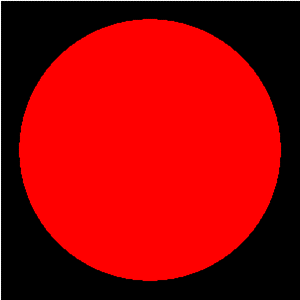
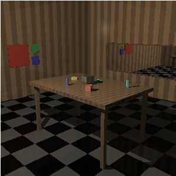
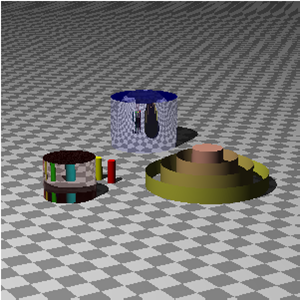
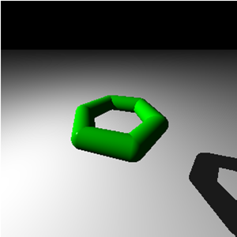

# trtc
My attempt at The Raytracer Challenge by Jamis Buck. I typically work with legacy MS Office code so this was my attempt to push the VBA envelope. 
It is also an opportunity to use/learn class modules

-----------------------------------------------------------------------------
 Chapter 1. Tuples, Points, and Vectors
-----------------------------------------------------------------------------
 As defined in the book, a Tuple is an ordered list. We are working with 3D
 coordinates (points & vectors) so we define elements to capture X, Y, and Z.
 To distinguish between a point and a vector the book use W. W=1 for points and
 W=0 for vectors

 Since I don't have inheritence or public Function overloading, I am working
 purely with tuples and dont have a point and vector class

 Not all math operations are applicable for tuples, points, and vectors but
 this is not a library for the public and assume they will be used correctly.

 Uses newTuple, newPoint and newVector functions defined in the Helper
 module to create objects

-----------------------------------------------------------------------------
 Chapter 2. Drawing on a Canvas
-----------------------------------------------------------------------------
 Currently modeling the Color class as a tuple so we include some RGB
 reference (newColor in the Helper module)

 Modeled output to PPM as identified in this chapter

 Updated model to output to a worksheet using resized cells as pixels

 Updated model to output to BMP using code found on the WWW

 Updated model to capture WKS output to various image formats using code
 found on the WWW.  Captures the worksheet onto a chart object as and uses
 the chartobject.save feature to write the various formats

-----------------------------------------------------------------------------
 Chapter 3. Matrices
-----------------------------------------------------------------------------
 2x2, 3x3, and 4x4 matrix math

-----------------------------------------------------------------------------
 Chapter 4. Matrix Transformations
-----------------------------------------------------------------------------
 Build transformations for Translate, Scale, Rotate, Shear

 Chaining
 Note that the order of the multiplications is important! Matrix
 multiplication is associative, but not commutative. When it comes to
 matrices, A × B is not guaranteed to be the same as B × A.

 So, if you want a single matrix that rotates, and then scales, and then
 translates, you can multiply the translation matrix by the scaling matrix,
 and then by the rotation matrix. That is to say, you must concatenate the
 transformations in reverse order to have them applied in the order you want!

 teapot -->  C * (B * (A * teapot)) = (C * B * A) * teapot

-----------------------------------------------------------------------------
 Chapter 5. Ray-Sphere Intersections
-----------------------------------------------------------------------------
 Create Rays and logic for intersection with a unit sphere. Also presents
 logic showing transformation relationship between ray and sphere. Logic
 for tracking Ray-Sphere intersections and which are visible or "Hits".

 Results in initial logic to display a Sphere outline in a 2D plane

-----------------------------------------------------------------------------
 Chapter 6. Light and Shading
-----------------------------------------------------------------------------
 Implements Phong reflective model. Model creates and uses light and
 material objects. Light is modeled as a Pointlight

 Updated model to work with multiple light sources (Ch 7 sidebar). Interface
 needs to change, Collections can't be updated and light sources are replaced
 during some of the tests

 Updated model to handle Spotlight (Ch 17). Need to handle fade

-----------------------------------------------------------------------------
 Chapter 7. Making a Scene
-----------------------------------------------------------------------------
 Create World model that cosists of lights and shapes. Also implements a
 pinhole camera object

 Camera model has been modified to attempt anti-aliasing (Ch 17)

-----------------------------------------------------------------------------
 Chapter 8. Shadows
-----------------------------------------------------------------------------
 All the minutiae to deal with shadows

 Updated model to opt out on casting shadows (Ch 11).

    CastsShadow = False

-----------------------------------------------------------------------------
 Chapter 9. Planes
-----------------------------------------------------------------------------
 Develop a plane model

-----------------------------------------------------------------------------
 Chapter 10. Patterns
-----------------------------------------------------------------------------
 Develop various patterns (Stripe, Gradient, Ring, Checker)

 Simplistic, works better on flat surfaces

-----------------------------------------------------------------------------
 Chapter 11. Reflection and Refraction
-----------------------------------------------------------------------------
 Reflection and refraction model. Using Schlick function to model Fresnel
 Effect

 Modified code to return index of refraction
   RefIndex(RI.GLASS)

# Scene

# Transparency

# Fresnel

-----------------------------------------------------------------------------
 Chapter 12. Cubes
-----------------------------------------------------------------------------
 Cube model

-----------------------------------------------------------------------------
 Chapter 13. Cylinders
-----------------------------------------------------------------------------
 Cylinder & Cone models

-----------------------------------------------------------------------------
 Chapter 14. Groups
-----------------------------------------------------------------------------
 Naive routine to implement a group model.

 Only partially works, look at others

-----------------------------------------------------------------------------
 Chapter 15. Triangles
-----------------------------------------------------------------------------
 Triangle model

 Created simple tool to import a subset of a Wavefront file

 Slower than sin to draw a simple Wavefront Object

-----------------------------------------------------------------------------
 Chapter 16. Constructive Solid Geometry (CSG)
-----------------------------------------------------------------------------
 N/A

-----------------------------------------------------------------------------
 Chapter 17. Next Steps
-----------------------------------------------------------------------------

-----------------------------------------------------------------------------
 Appendix 1. Rendering the Cover Image
-----------------------------------------------------------------------------

-----------------------------------------------------------------------------
 Extra
-----------------------------------------------------------------------------

# Chapter 9 w/transparency, different RIs

# Scene base on Peter Shirley's work

